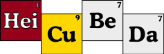
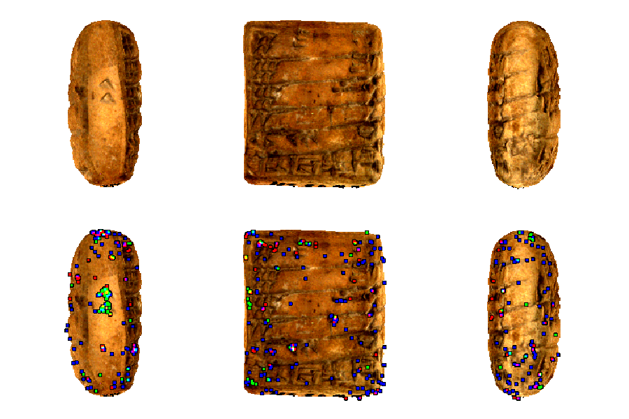

<h1 align="center">
DEEP LEARNING CLASSIFICATION OF LARGE-SCALE POINT CLOUDS: A CASE STUDY ON CUNEIFORM TABLETS
</h1>


# Citation
If you use this code in your research, please cite the paper:

```
@inproceedings{fhagelskjaer2022,
title= {Deep learning classification of large-scale point clouds: A case study on cuneiform tablets}
author={F. {Hagelskjaer}},
year={2022}}
```

***

## Dataset

The project is based on the HiCuBeDa dataset, which is available [online](https://gigamesh.eu/heicubeda/).



Introduced in the paper: "Breaking the Code on Broken Tablets: The Learning Challenge for Annotated Cuneiform Script in Normalized 2D and 3D Datasets"

***

##  Overview

This work introduce a network for processing very large point clouds. The method is tested on a comparison dataset of cuneiform tablets.

Additionally two new classification tasks are introduced. This is the presence of seals on the tablets and the presence of left side signs.

A novel visualization method is also introduced. The method is named Maximum Attention, as the points activated in the MaxPool layer is shown. This method is shown in the image below, where positive contributions to the classification of left side signs are shown as green. These points are mostly centered around the actual sign. 



The network is based on [DGCNN](https://github.com/WangYueFt/dgcnn).

The work is inspired by the paper: "Period Classification of 3D Cuneiform Tablets with Geometric Neural Networks"

***

## File structure

1. **notebooks:** notebook for network training and Maximum Attention visualization
2. **dataset:** the downloaded zip files and dataset files
3. **scripts:** python scripts to generate the point clouds
4. **images:** images used for this README